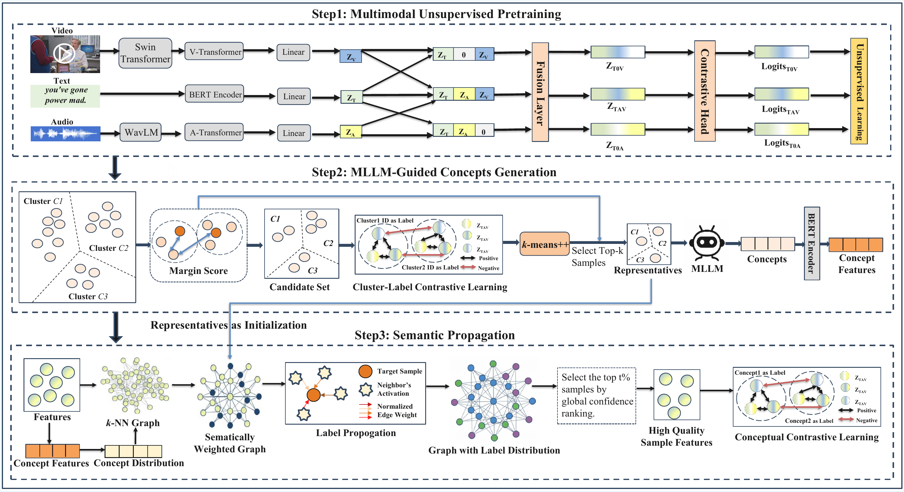
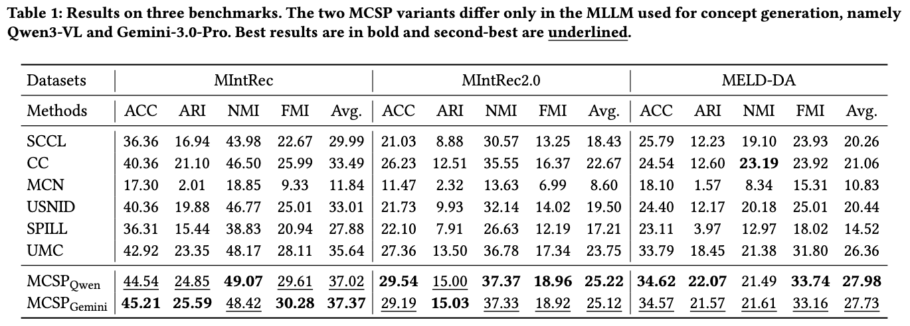

# Unsupervised Multimodal Intent Discovery via MLLM-Guided Concept Generation and Semantic Propagation

This repository provides the official PyTorch implementation of:

[Unsupervised Multimodal Intent Discovery via MLLM-Guided Concept Generation and Semantic Propagation](https://arxiv.org/abs/2607.21908) (**Accepted at ACM Multimedia 2026, MM '26**).

## 1. Introduction

Unsupervised multimodal intent discovery aims to identify latent intents from unlabeled text, video, and audio. We propose MCSP, a framework that combines MLLM-guided concept generation with semantic propagation. MCSP selects reliable cluster representatives, generates interpretable intent concepts through contrastive reasoning, and uses these concepts to guide graph propagation and representation learning.

## 2. Dependencies

Our environment uses **Python 3.9.23**, **PyTorch 2.8.0**, and **CUDA 12.8**. We recommend using Anaconda to create an environment:

```bash
conda create -n mcsp python=3.9.23 pip=25.2 -y
conda activate mcsp

python -m pip install torch==2.8.0 torchvision==0.23.0 \
  --index-url https://download.pytorch.org/whl/cu128
python -m pip install -r requirements.txt
python -m pip check
```

## 3. Usage

### 3.1 Data

The data can be downloaded through the following links:

[Download data from Google Drive](https://drive.google.com/drive/folders/1nCkhkz72F6ucseB73XVbqCaDG-pjhpSS)

MCSP loads TSV utterance files and pre-extracted Swin video and WavLM audio features. Prepare them in the following structure:

```text
DATA_ROOT/
├── MIntRec/
│   ├── train.tsv
│   ├── dev.tsv
│   ├── test.tsv
│   ├── video_data/
│   │   └── swin_feats.pkl
│   └── audio_data/
│       └── wavlm_feats.pkl
├── MIntRec2.0/
│   ├── train.tsv
│   ├── dev.tsv
│   ├── test.tsv
│   ├── video_data/
│   │   └── swin_roi.pkl
│   └── audio_data/
│       └── wavlm_feats.pkl
└── MELD-DA/
    ├── train.tsv
    ├── dev.tsv
    ├── test.tsv
    ├── video_data/
    │   └── swin_feats.pkl
    └── audio_data/
        └── wavlm_feats.pkl
```

Set `DATA_ROOT` to the parent directory of the datasets. The feature files must be pickle dictionaries whose sample IDs match the TSV files. Place a Hugging Face-compatible [BERT-base-uncased checkpoint](https://huggingface.co/google-bert/bert-base-uncased) at `uncased_L-12_H-768_A-12/` in the repository root. If you use another location, update both [`configs/__init__.py`](configs/__init__.py) and `pretrained_bert_model` in the selected MCSP configuration.

### 3.2 Configuration Files

The dataset configurations are under [`configs/`](configs):

| Dataset | Configuration | Video features | Audio features |
| --- | --- | --- | --- |
| MIntRec | `mcsp_MIntRec.py` | `swin_feats.pkl` | `wavlm_feats.pkl` |
| MIntRec2.0 | `mcsp_MIntRec2.py` | `swin_roi.pkl` | `wavlm_feats.pkl` |
| MELD-DA | `mcsp_MELD-DA.py` | `swin_feats.pkl` | `wavlm_feats.pkl` |

For a first run, set `pretrain=True`, `train=True`, `save_model=True`, and `use_llm=False` in the Python config before running an example script, since config values override same-named CLI arguments; with `use_llm=False`, the default workflow loads the bundled concept bank at `methods/unsupervised/MCSP/intent_concepts.json`, covering seeds `0`–`4` for all three datasets and requiring no API key or remote calls. To generate new concepts online, set `use_llm=True`, provide `MCSP_API_KEY` via the environment, configure a video-capable `llm_model_name` supported by the endpoint in `manager.py`, and review the raw-video paths and provider settings in `mllm_reasoning.py`.

### 3.3 Run Training / Testing

Run commands from the repository root. Each script trains and then evaluates seeds `0` through `4`:

```bash
export DATA_ROOT=/path/to/DATA_ROOT
export GPU_ID=0

# MIntRec
bash examples/run_mcsp.sh

# MIntRec2.0
bash examples/run_mcsp_mintrec2.sh

# MELD-DA
bash examples/run_mcsp_meld.sh
```

To reuse a saved pretraining checkpoint, set `pretrain=False` and `train=True`. For testing only, set `pretrain=False` and `train=False`, then run the same command with the dataset, seed, backbone, and output path used during training. Testing requires both the pretraining and final checkpoints:

```text
<output_path>/mcsp_mcsp_<dataset>_bert-base-uncased_<seed>/models/
├── pretrain/
│   └── pytorch_model.bin
└── pytorch_model.bin
```

## 4. Model

The overview of MCSP:



The framework has three stages:

1. **Multimodal unsupervised pretraining:** performs mask-based contrastive learning on multimodal inputs to establish a robust joint embedding space.
2. **MLLM-guided concept generation:** leverages MLLM-guided reasoning to generate semantic concepts from high-quality representative samples.
3. **Semantic propagation:** integrates evidence diffusion and concept-driven supervision to refine the embedding manifold for accurate intent identification.

## 5. Experimental Results




## 6. Citation

If you are insterested in this work, and want to use the codes or results in this repository, please star this repository and cite by:

```bibtex
@misc{gu2026unsupervised,
  title={Unsupervised Multimodal Intent Discovery via MLLM-Guided Concept Generation and Semantic Propagation},
  author={Yunjin Gu and Qianrui Zhou and Hua Xu},
  year={2026},
  eprint={2607.21908},
  archivePrefix={arXiv},
  primaryClass={cs.MM},
  url={https://arxiv.org/abs/2607.21908}
}
```

## 7. Acknowledgements

Parts of this implementation build on [UMC](https://github.com/thuiar/UMC). We thank the authors and contributors for sharing their work.

For questions or reproducibility issues, please open a GitHub issue with your environment, command, configuration, and relevant error log.
